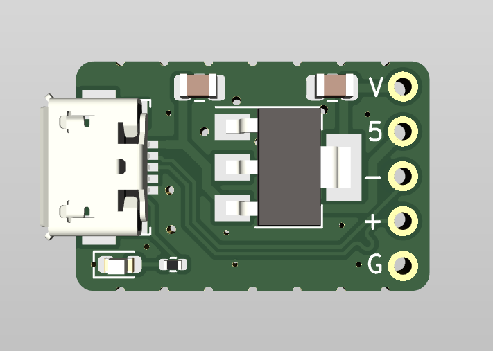
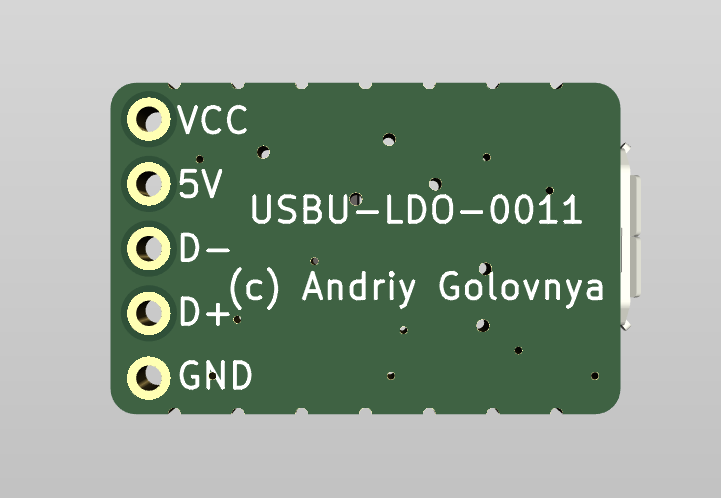
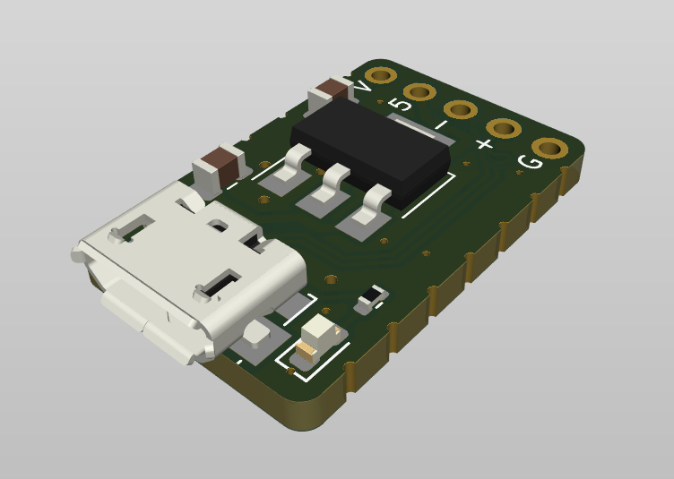

# USBU-LDO Project

The **USBU-LDO** project is a aimed to create low-cost DIY board with microUSB with LDO power supply.

## USBU-LDO Board

The **USBU-LDO** is simple board that provides a microUSB connector and a low-dropout voltage regulator (LDO) to power a small device from a microUSB power source. The board is designed to be as small as possible and to be used in a variety of applications where a small, low-cost, and easy-to-use power supply is needed.

Current design is based on the [LM1117](https://www.ti.com/lit/ds/symlink/lm1117.pdf) LDO voltage regulator, which can provide up to 1A of output current at 3.3V. However, the board can be easily modified to use a different LDO voltage regulator if needed.

Preview:

You can view the [Schematics in PDF format](doc/USBU-LDO.pdf) for detailed information.

STEP 3D file is available [here](doc/USBU-LDO.step).

Features:

- MicroUSB connector for 5V power delivery
- 3.3V LDO voltage regulator up to 1A output current
- LED power indicator

CAM files, as well as the BOM and CPL files for JLCPCB and NextPCB, are available.

## Version History

### v1.1

- Improved microUSB connector footprint to produce in NextPCB

### v1.0

Initial release.

## Links

- TBD

## How to Help

Your contributions as code, resources, or finances are welcome! Please contact me directly via email at andriy.golovnya@gmail.com or through my [GitHub profile](https://github.com/red-scorp).

If you'd like to make a financial contribution, you can donate via [PayPal](http://paypal.me/redscorp) or [Ko-Fi](http://ko-fi.com/redscorp). Your support is greatly appreciated.

Thanks in advance!